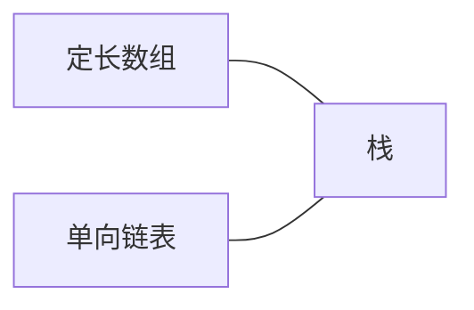
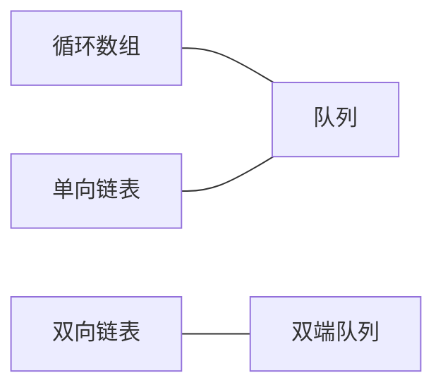
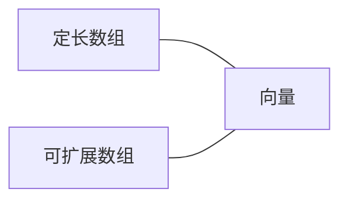
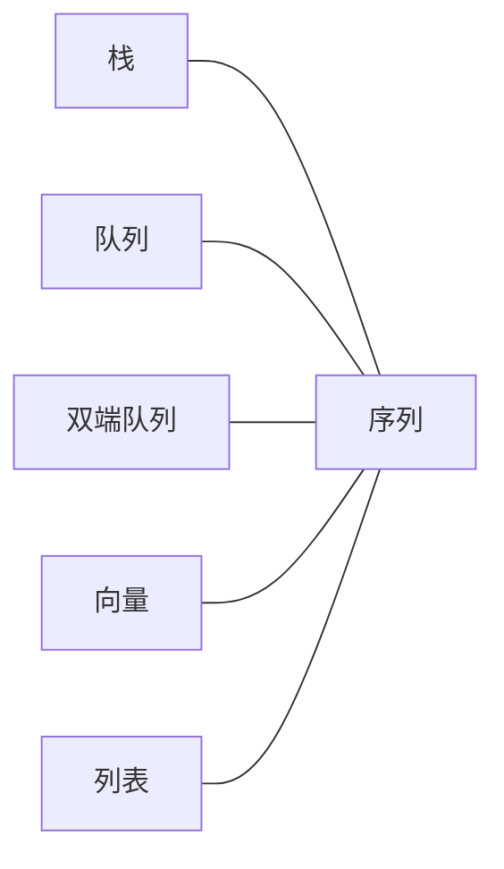

# Data Structure & Algorithms For Java

数据结构与算法 - Java 语言描述

```mermaid
graph LR
    定长数组---栈
    单向链表---栈
```

```mermaid
graph LR
    循环数组---队列
    单向链表---队列
    双向链表---双端队列
```

```mermaid
graph LR
    定长数组---向量
    可扩展数组---向量
```

```mermaid
graph LR
    双向链表---列表
```

```mermaid
graph LR
    栈---序列
    队列---序列
    双端队列---序列
    向量---序列
    列表---序列
```